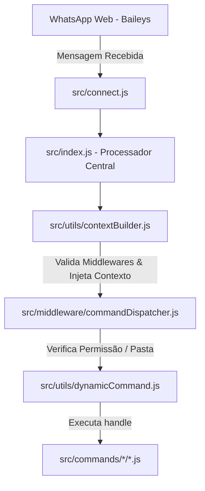

# 🤖 GUIA DE AGENTES E DESENVOLVEDORES DO CHAINY

Este arquivo é a única fonte de verdade para agentes de IA e contribuidores que precisam de contexto rápido, preciso e confiável sobre a arquitetura e os padrões do projeto **Chainy**.

Use este guia para:
- Mapeamento da arquitetura e fluxo de execução do bot
- Regras e padrões de autoria de comandos
- Diretrizes de persistência e I/O de dados via banco em memória
- Padrões obrigatórios de Clean Code, commits, mensagens e performance

---

## 🏗️ VISÃO GERAL DO PROJETO

O **Chainy** é um framework modular de bot para WhatsApp desenvolvido em **Node.js (ESM)** com foco em alta performance, concorrência segura e modulação de comandos.

### Princípios de Design:
- **Comandos Dinâmicos Baseados em Arquivos:** Cada comando (ou grupo de aliases) reside em seu próprio arquivo sob `src/commands/`.
- **Roteamento por Nível de Permissão:**
  - `src/commands/owner/` ➔ Comandos restritos ao dono do bot (validação automática no dispatcher).
  - `src/commands/admin/` ➔ Comandos administrativos de grupos (validação automática de admin no dispatcher).
  - `src/commands/member/` ➔ Comandos livres para qualquer usuário.
  - `src/commands/rpg/` ➔ Comandos do ecossistema de RPG integrado.
- **I/O Seguro e Banco em Memória:** Todos os arquivos de dados em `dados/database/` utilizam cache em memória com escritas atômicas e debounced para eliminar race conditions e evitar bloqueio de disco.

---

## 📂 ESTRUTURA COMPLETA DE PASTAS

```text
chainy/
├── dados/                       # Armazenamento e persistência de dados
│   ├── database/                # Cache em memória e arquivos JSON do banco
│   │   ├── grupos/              # Configurações de segurança e status de cada grupo
│   │   ├── dono/                # Credenciais, configurações globais e blacklist
│   │   ├── backups/             # Backups automáticos gerados pelo banco
│   │   ├── qr-code/             # Credenciais de sessão do WhatsApp (Baileys)
│   │   └── tmp/                 # Arquivos temporários (mídias e cache)
│   └── config.json              # Configuração básica (Dono, Prefixo, etc.)
├── src/
│   ├── commands/                # Comandos dinâmicos (separados por permissão)
│   │   ├── admin/               # Comandos administrativos do grupo
│   │   ├── member/              # Comandos livres para qualquer usuário
│   │   ├── owner/               # Comandos restritos ao dono do bot
│   │   └── rpg/                 # Comandos do sistema de RPG
│   ├── handlers/                # Manipuladores de eventos do Baileys (connection, messages, groupParticipants)
│   ├── middleware/              # Filtros de execução, limites, despacho e segurança
│   ├── security/                # Submódulos de proteção consolidados
│   │   ├── anti/                # Proteções anti (antiDel, antiSpam, mutedUsers, rentalMode, afk, etc)
│   │   └── guards/              # Guardas de segurança (antipalavra, antitoxic, antistickerplus, temuScammer)
│   ├── funcs/                   # Integrações, serviços e dados estáticos
│   │   ├── downloads/           # Downloaders (YouTube, TikTok, Spotify, Instagram, Facebook, etc)
│   │   ├── utils/               # Utilitários de serviço (jogos, search, media, sticker)
│   │   └── json/                # Bancos de dados estáticos de jogos (quiz, forca, stop, etc)
│   ├── views/                   # Geradores de texto dos menus exibidos pelo comando /menu
│   ├── utils/                   # Núcleo de utilitários do framework
│   │   ├── database/            # Submódulos do banco (economy, leveling, rental, config, support, io)
│   │   ├── helpers/             # Helpers puros (formatting, jsonIo, jidLidResolver, dataValidators, paramParser)
│   │   └── messages/            # Mensagens centralizadas por domínio (admin, member, owner, rpg, etc)
│   ├── workers/                 # Jobs agendados (cron) e workers em background
│   └── .scripts/                # Scripts npm (start, config, update)
├── AGENTS.md                    # Guia para agentes de IA e contribuidores
├── README.md                    # Documentação geral e guia de instalação
└── package.json                 # Manifesto do projeto e scripts npm
```

---

## ⚙️ ARQUITETURA E FLUXO DE EXECUÇÃO



1. **`src/connect.js`**: Inicia a conexão Baileys WhatsApp, carrega credenciais/sessão e trata reconexões.
2. **`src/index.js`**: Ponto de entrada do manipulador de mensagens. Recebe os eventos de mensagens e delega o processamento.
3. **`src/utils/contextBuilder.js`**: Constrói o contexto injetado no comando. Converte JID ➔ LID, aplica middlewares globais e provê helpers como `reply()`.
4. **`src/middleware/commandDispatcher.js`**: Valida a pasta do comando (`owner/`, `admin/`, `member/`, `rpg/`), verifica cooldowns, blacklist e autorizações.
5. **`src/utils/dynamicCommand.js`**: Carrega dinamicamente os módulos de comandos indexados sob `src/commands/`.
6. **`handle()`**: Função assíncrona do comando final executada com todas as dependências pré-injetadas.

---

## 📝 GUIA DE AUTORIA DE COMANDOS

### Modelo Padrão de Comando ES Module:

```javascript
export default {
  name: "nome_do_comando",
  description: "Descrição clara da funcionalidade",
  commands: ["alias1", "alias2"],
  usage: `${global.prefixo}nome_do_comando <argumentos>`,
  handle: async ({ reply, q, isGroup, MESSAGES, groupData, groupFile }) => {
    // Lógica do comando
    await reply(MESSAGES.geral.sucesso);
  },
};
```

### 🚨 Regras Vitais de Autoria:
1. **Sem verificações manuais de permissão:** O `commandDispatcher` valida permissões automaticamente com base na pasta (`src/commands/admin/`, `src/commands/owner/`). Não adicione `if (!isGroupAdmin)` no topo de comandos administrativos.
2. **Mensagens Centralizadas:** NUNCA escreva textos de resposta diretamente com strings literais no comando (ex: `reply("Erro!")`). Use a estrutura centralizada em `MESSAGES` (mapeada de `src/utils/messages.js`).
3. **Persistência de Dados Segura:** NUNCA utilize `fs.readFileSync`/`fs.writeFileSync` diretamente. Use a fachada unificada em `src/utils/database/io.js`:
   - `db.read(path, default)` ➔ Leitura síncrona com cache TTL em memória (30s).
   - `db.readAsync(path, default)` ➔ Leitura assíncrona que não bloqueia o event loop.
   - `db.writeSafe(path, data)` ➔ Gravação síncrona atômica (write+rename) com backup. **Use dentro da função `handle()` de comandos.**
   - `db.writeSync(path, data)` ➔ Gravação síncrona leve sem backup.
   - `db.queue(path, data)` ➔ Gravação assíncrona em fila sequencial. **Use em workers e jobs de segundo plano.**
   - `db.debounced(path, data, delayMs=3000)` ➔ Debounce para gravações de alta frequência (economia, leveling).
   - `db.exists(path)` / `db.existsSync(path)` ➔ Verificação de existência do arquivo.
   - Importação padrão: `import db from '../../utils/database/io.js';` ou `import { read, writeSafe } from '../../utils/database/io.js';`.

---

## 👨‍💻 CONVENÇÕES DE CLEAN CODE & PERFORMANCE

1. **Nomes Declarativos:** Utilize nomes claros e autoexplicativos em variáveis e funções. Evite abreviações genéricas (`data`, `item`, `x`, `temp`).
2. **Separação de Responsabilidades (MVC):** Mantenha comandos focados em controle de fluxo. Lógicas de cálculo, pesquisas complexas ou manipulação gráfica devem residir em `src/funcs/`.
3. **Mensagens Dinâmicas:** Centralize mensagens com parâmetros usando funções em `MESSAGES`: `` cooldown: (s) => `⏳ Aguarde ${s}s` ``.
4. **Desempenho & I/O:** Dê preferência a dados já em cache. Reduza operações síncronas pesadas no event loop principal.

---

## 📌 PADRÃO DE COMMITS (OBRIGATÓRIO)

Siga estritamente a convenção de prefixo e verbos no infinitivo/presente:
- **Formato Padrão:** `chainy: descrição curta e clara da alteração`
- **Exemplos Corretos:**
  - `chainy: otimizar carregamento das páginas de grupos`
  - `chainy: adicionar suporte a limite de resolução no playvid`
  - `chainy: corrigir tratamento de erros no banco em memória`
- **Mensagens Proibidas:** `update`, `fix`, `changes`, `chainy: correções gerais`.

---

## 🤖 DIRETRIZES CRÍTICAS PARA AGENTES DE IA

Ao efetuar modificações no repositório:
1. **Respeite a Arquitetura do Framework:** Não contorne middlewares, gerenciadores de banco ou despachantes globais de comandos.
2. **Investigação da Causa Raiz:** Evite gambiarras e parciais (workarounds como `setTimeout` para forçar escrita). Investigue a raiz do problema no fluxo de I/O ou cache.
3. **Inspeção Prévia:** Mapeie o uso de variáveis e métodos com as ferramentas de busca (`grep_search`, `view_file`) antes de efetuar substituições.
4. **Segurança de Credenciais:** Nunca exponha arquivos de sessão do WhatsApp, tokens ou dados privados. Mantenha edições focadas e granulares.
